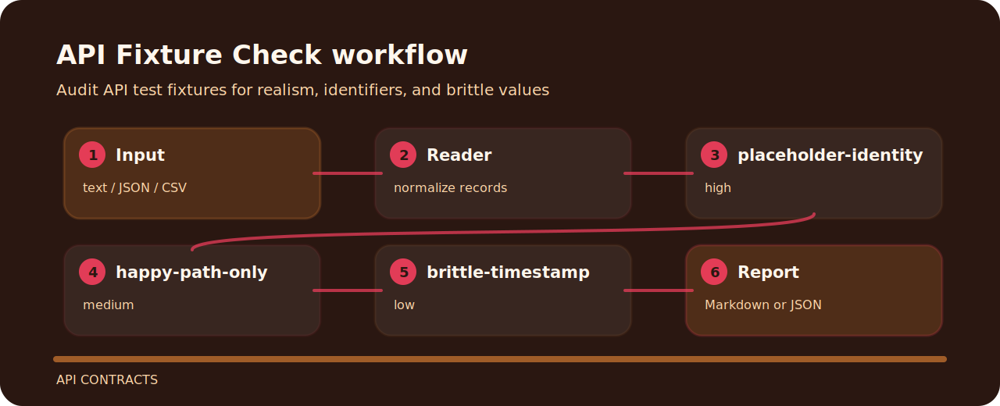

# API Fixture Check


Audit API test fixtures for realism, identifiers, and brittle values. It keeps the review small: one input file, a short list of findings, and enough context to fix the line that caused the warning.

## What gets flagged

| Signal | Level | What it flags | Fix direction |
| --- | --- | --- | --- |
| `placeholder-identity` | high | placeholder identity detected | Use realistic non-production fixture values. |
| `happy-path-only` | medium | fixture set lacks negative cases | Add failure, boundary, and permission-denied cases. |
| `brittle-timestamp` | low | timestamp fixture may be brittle | Use stable generated timestamps or explicit test clocks. |

## Command path

```bash
git clone https://github.com/mertefekurt/api-fixture-check.git
cd api-fixture-check
python -m pip install -e ".[dev]"
api-fixture-check examples/sample.txt
```

## Review path


