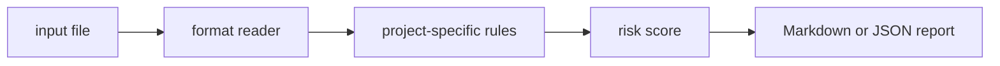

# api-fixture-check

`api-fixture-check` is a small local CLI that audit API test fixtures for realism, identifiers, and brittle values.

## Why it is useful

Bad fixtures make tests pass for cases production never sees. This CLI flags brittle IDs, placeholder data, and missing negative cases.

## Key features

- reads text, JSON, JSONL, or CSV inputs
- returns Markdown or JSON reports
- supports severity-based CI exit codes
- keeps all checks deterministic and offline
- includes focused rules for this project:
- `placeholder-identity`: placeholder identity detected
- `happy-path-only`: fixture set lacks negative cases
- `brittle-timestamp`: timestamp fixture may be brittle

## Installation

```bash
python -m pip install -e ".[dev]"
```

## Usage

```bash
api-fixture-check examples/sample.txt
api-fixture-check examples/sample.txt --json
api-fixture-check path/to/input.txt --fail-on medium --out report.md
python -m api_fixture_check --help
```

Example input:

```text
fixture user id 123 email test@test.com only happy path no negative case
```

## CLI options

```text
api-fixture-check INPUT [--format auto|text|jsonl|csv|json] [--json]
             [--fail-on low|medium|high] [--out PATH]
```

`INPUT` is any fixture JSON, text, or review notes. The tool exits with code `2` when findings meet the selected
threshold, which makes it easy to use in GitHub Actions or release checks.

## Workflow



## Tests

```bash
ruff check .
pytest
python -m api_fixture_check --help
```

## License

MIT
